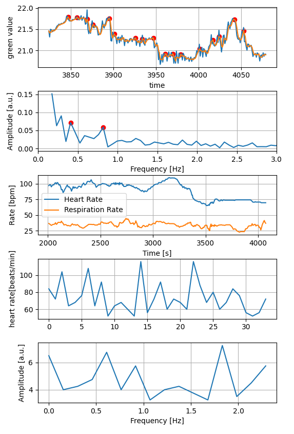
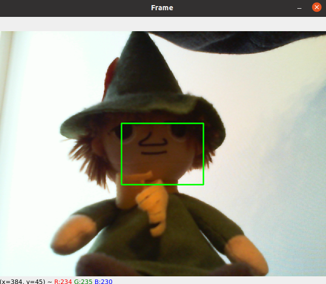

# HeartRate Estimation from Camera

Estimate heart rate software from camera using OpenCV and Python.

# DEMO





# Features

Developed the following features in Cpp and Python.

for Python version

* Plot time-series graph of the mean value of the density of green pixels from the camera image
* Perform FFT from the above graph 
* Perform FFT peak detection, estimate pulse rate and respiratory rate, and plot
* Perform peak detection from the time series graph and plot the peak interval (RRI)
* Frequency analysis of the above RRI graph using FFT to compute stress-related indicators called LF/HF

for Cpp version (under development)

* Plot time-series graph of the mean value of the density of green pixels from the camera image
* Perform FFT from the above graph 

# Requirement

* Python 3.8.10 or higher
* numpy
* matplotlib
* OpenCV  
* scipy

# Usage

* Prepare a UVC camera.
* You must first pre-match the device number of the USB camera and
* Human skin to be placed in the green frame within the OpenCV Frame output.
* You should not move.

```bash for Python
git clone git@github.com:imoted/heart_rate_estimation_from_camera.git
cd git@github.com:imoted/heart_rate_estimation_from_camera.git
python3 heartrate_estimation.py
```
To exit the program Enter ESC


```bash for Cpp
cd git@github.com:imoted/heart_rate_estimation_from_camera.git
mkdir build && cd build
cmake .. 
make
./heart_rate_estimation
```
To exit the program Enter ESC

# Note

* When moving, values are greatly blurred. Stillness is essential.
* Data acquisition is much slower when plots are turned on.
  * To turn off the plotting, please change the "enable_plot" to False
* To detect peaks exactly, please adjust the "RRI_PEAK_THRETHOLD" and "HR_FFT_PEAK_THRETHOLD" constant
  * Higher constants increase peak detection sensitivity.

# Author

* Author :  Tadashi imokawa

# License

"hoge" is under [MIT license](https://en.wikipedia.org/wiki/MIT_License).
